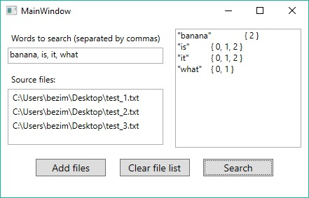

# InvertedIndex

A data structure in which for each word in the collection of documents in the corresponding list all the documents in the collection
in which it was found are listed. The inverted index is used to search by text.<br />
[Wikipedia](https://en.wikipedia.org/wiki/Inverted_index)

## Example
test_1.txt
```
it is what it is
```
test_2.txt
```
what is it
```
test_3.txt
```
it is a banana
```
"Search example": {inverted index}
```
"banana": {2}
"is":     {0, 1, 2}
"it":     {0, 1, 2}
"what":   {0, 1}
```

## Screenshots
